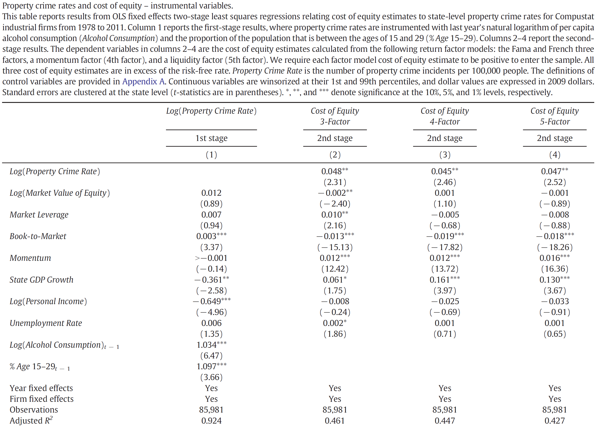

# Statistics Stata


## A few basic commands

### Loading a dataset

Load the sample dataset:

```Stata
use "S:\_Joost\2017_methods_ufl\sample_dataset.dta", clear

```

If you have a balanced dataset you can set it as a time series, so you can easily get to lagged values:

```Stata
destring  gvkey, replace
tsset gvkey fyear
```

## Generate dummy variables

```Stata
tabulate fyear, gen(dfyear)
tabulate ff12_, gen(dff12_)
```

### Summary statistics

```Stata
sum ret beta // summary statistics
sum eps, d // detailed summary statistics
tab fyear // number of obs by year
tabstat ret beta size btm bve eps, stats (n mean min p25 p50 p75 max sd) col(stat) 
```


### OLS regression
```Stata
reg ret beta size btm bve eps
```


## Storing results

To export multiple regression output (to further process in Excel), use packages `eststo` (needs to be installed) and `esttab`.

To install:
```Stata
findit eststo // click on the link for 'st0085_1', then 'click here to install'
```

Example: results for two different models exported to a csv file (you can actually click on the link)

```Stata
eststo clear
eststo: reg ret beta size btm bve eps 
eststo: reg ret beta size btm bve eps dfyear*
esttab using M:\stata_output_table.csv, b(3) t(2) drop(dfyear*) star(* 0.10 ** 0.05 *** 0.01) r2
```


### Fixed Effects regression

Fixed firm effects regression with clustering of standard errors by firm. 

```Stata
// fixed firm effects and year dummies
xtreg ret beta size btm bve eps dfyear* , fe vce(cluster gvkey)
```


## Logistic regression

You can filter the data used in the regression with `if`. For example, a logistic regression using observations after 2012 with clustering of standard errors by firm:

```Stata
logit loss beta size btm bve if fyear > 2012, asis robust cluster(gvkey)
```

> Note: the `asis` option prevents Stata from dropping observations in clusters with few observations

## Clustering of standard errors

In the above examples we have seen a few instances where standard errors were clustered. For OLS there is also the `cluster2` package, where you specify the firm identifier with 'fcluster' and time clustering with 'tcluster'.

The package can be downloaded from [Petersen's website](http://www.kellogg.northwestern.edu/faculty/petersen/htm/papers/se/se_programming.htm), the direct link is [http://www.kellogg.northwestern.edu/faculty/petersen/htm/papers/se/cluster2.ado](http://www.kellogg.northwestern.edu/faculty/petersen/htm/papers/se/cluster2.ado). 

See here for [instructions on installing](http://www.stata.com/manuals13/u17.pdf):

- type 'sysdir' in Stata command window to see all the places where Stata will look for packages
- with the UF Apps File manager, copy the downloaded 'cluster2.ado' file to 'M:\Documents\StataAdo\Plus'

Compare the regression results of `reg` with `cluster2`:

```Stata
reg ret beta size btm bve eps
cluster2 ret beta size btm bve eps, fcluster(gvkey) tcluster(fyear)
```


## 2 Stage Least Squares (2SLS)

2SLS is used when the dependent variable's error terms are correlated with an independent variable.

> Also called instrumental variables.

The model
```
Y = a + bX + cZ + e
```

Assume that Z and e are correlated (i.e., endogenous). When using 2SLS you regress Z on some instruments (V and W), and you can also include variables in the initial regression (in this case X):

```
Z = d + eX + fV + gW + f
```

You then use the fitted value of Z (say: Z*) in the original regression:
```
Y = a + bX + cZ* + e
```

The idea is that the part of Z that correlates with e is not in Z*.

See the [documentation](http://www.stata.com/manuals13/rivregress.pdf) section 2SLS and LIML estimators for an example.

### Example

Brushwood et al. (2016) examine the relation between crime and the cost of capital (Property crime, earnings variability, and the cost of capital, Journal of Corporate Finance) (they document that companies that are headquartered in states with higher crime have more variable earnings and higher cost of capital). In one of their analyses they use 2SLS.

Their instrumental variables for crime:
- alcohol consumption (in the state)
- percentage of the population that is 15-29 years old

In column 1 they run the first stage, and the fitted value of crime they use as a dependent variable in columns 2-4: 



