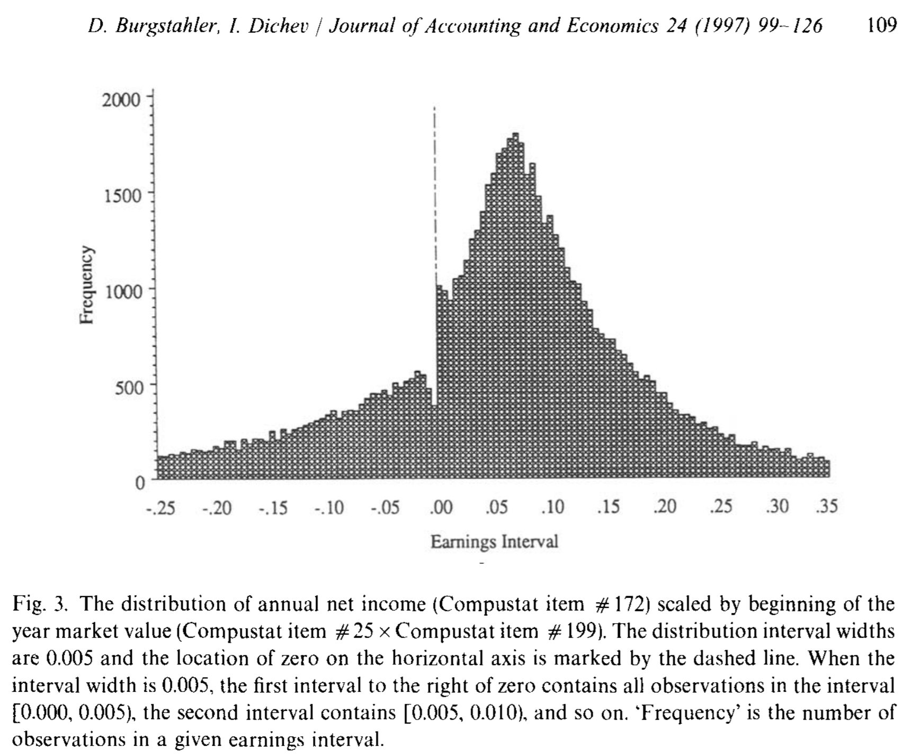
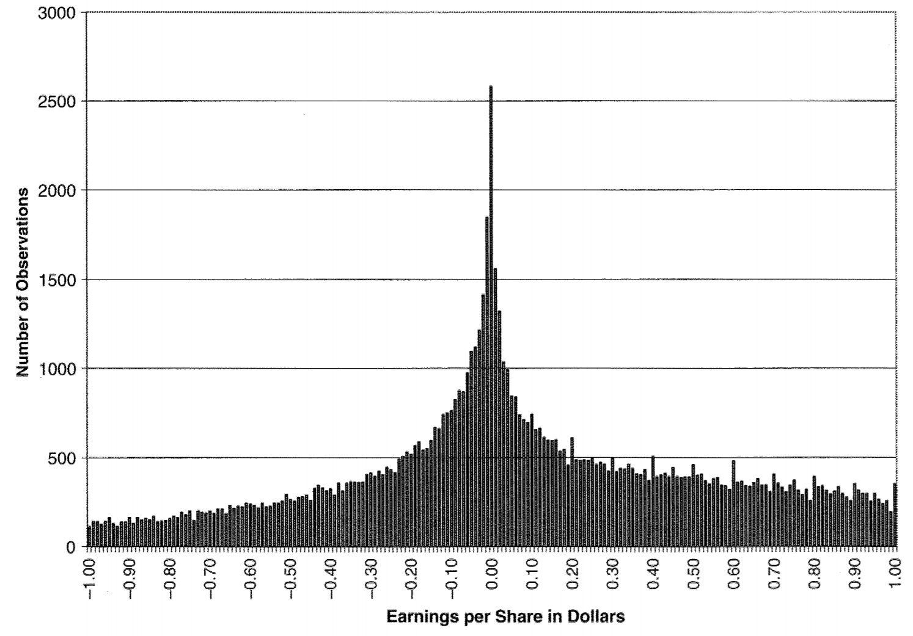
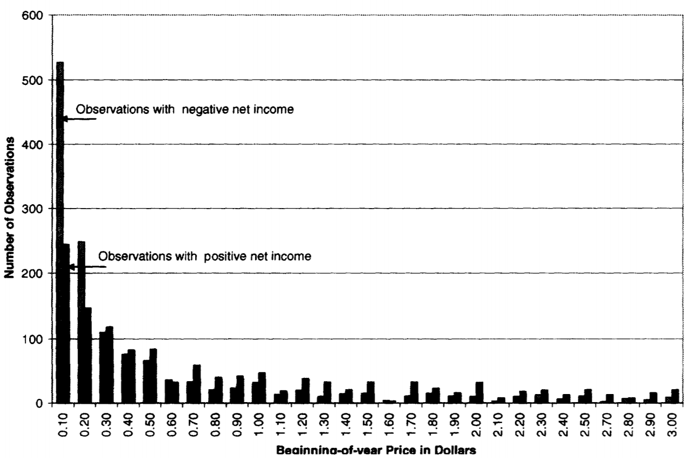

# Scaling

## Heteroscedasticity

One of the problems of heteroscadasticity is that you may get significant results for variables that are driven by scale.

Let's run a regression where we run market value on the number of employees:

```SAS
%let wrds = wrds-cloud.wharton.upenn.edu 4016;options comamid = TCP remote=WRDS;
signon username=_prompt_;

rsubmit;
	proc sql;
		create table myCompustat as
		select gvkey, fyear, prcc_f * csho as marketcap, at, ceq, emp 
		from comp.funda 
		where
			2006 <= fyear <= 2015
			and missing(prcc_f + csho + at + ceq + emp) eq 0
			and indfmt='INDL' and datafmt='STD' and popsrc='D' and consol='C'; 
	quit;
	proc download data=myCompustat out=myComp;run;
endrsubmit;

/* Does the number of employees explain market cap? */
proc reg data=f_sample_wins;   
  model marketcap = emp;  
quit;

```

## Choice of scalar 

To deal with size effects driving regression results you need to select an appropriate scalar. 

### Earnings management

From 'Earnings management to avoid earnings decreases and losses' (Burgstahler and Dichev, 1997):



The variable displayed is earnings per share scaled by stock price. The discontinuity around 0 is often mentioned as evidence that managers manage earnings to avoid losses.

From Durtschi and Easton (Earnings Management? The Shapes of the Frequency Distributions of Earnings Metrics Are Not Evidence Ipso Facto):



The above figure shows earnings per share unscaled; it does not have the same discontinuity around 0 (it does show some 'spikes' around 0.10, 0.20, 0.30 suggesting that managers prefer to manage up to round numbers).



The authors show that stock price is correlated with the sign of earnings: firms that have losses often have a low stock price, firms with profits tend to have a higher stock price. For the eps/p graph this means that data points on the 'loss' side (left side of y-axis) are pushed to the left (dividing by small price makes eps/p become more negative). Profits get scaled by a larger price, pushing these observations against the y-axis.

> Note: The purpose of Durtchi and Easton is to highlight the importance of scaling, not to argue earnings management does not exist.

### Scalar correlates with independent variables

Suppose you have the following regression: `Y = a + bX + cZ + e`, but both 'Y' and 'Z' are correlated with size ('S').

You can then scale these: `Y/S = a + bX + cZ/S + e`. 

> What if X and S are correlated? The coefficient b for X will capture the effects for both Y and S.


